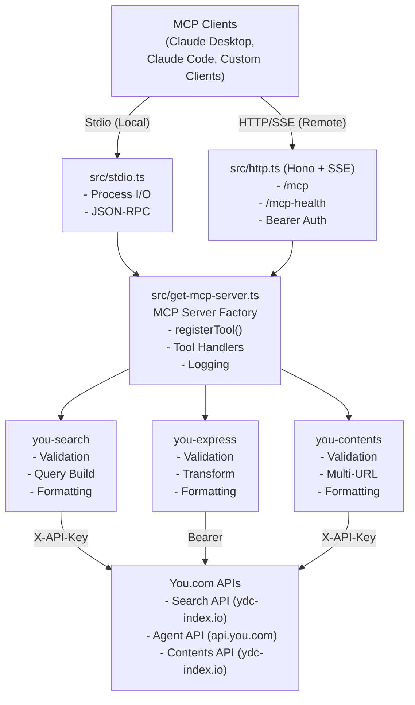

# You.com MCP Server Development Guide

A Model Context Protocol (MCP) server that provides web search, AI agent, and content extraction capabilities through You.com's APIs.

---

> **Note for end users**: If you want to use this MCP server (not develop or contribute), see [README.md](./README.md) for setup instructions, getting started guides, and usage examples.

**This guide (AGENTS.md) is for developers, contributors, and AI coding agents** who want to:

- Set up a local development environment
- Understand the codebase architecture
- Contribute code or bug fixes
- Run tests and quality checks
- Review pull requests

---

## Tech Stack

- **Runtime**: Bun >= 1.2.21 (not Node.js)
- **Framework**: Model Context Protocol SDK ^1.24.3
- **HTTP Server**: Hono ^4.10.7 with @hono/mcp for HTTP transport (SSE protocol support)
- **Validation**: Zod ^4.1.13 for schema validation
- **Testing**: Bun test (built-in test runner)
- **Code Quality**: Biome 2.3.8 (linter + formatter)
- **Type Checking**: TypeScript 5.9.3
- **Git Hooks**: lint-staged 16.2.7

## Quick Start

### Setup Environment

```bash
echo "export YDC_API_KEY=your-actual-api-key-here" > .env
source .env
```

### Development Commands

```bash
bun install                    # Install dependencies
bun run dev                    # Start stdio server
bun start                      # Start HTTP server on port 4000
bun test                       # Run tests
bun test:coverage              # Run tests with coverage report
bun test:watch                 # Run tests in watch mode
bun run check                  # Run all checks (biome + types + package format)
bun run check:write            # Auto-fix all issues
```

## Code Style

This project uses [Biome](https://biomejs.dev/) for automated code formatting and linting. Most style rules are enforced automatically via git hooks.

> **For universal code patterns**, see [`.claude/skills/code-patterns`](../../.claude/skills/code-patterns/SKILL.md)

> **For MCP-specific patterns**, see [`.claude/skills/mcp-patterns`](../../.claude/skills/mcp-patterns/SKILL.md)

The mcp-patterns skill covers:
- Schema design with Zod (`.describe()` for documentation)
- Error handling (try/catch, never throw from MCP tools)
- Logging (`getLogger(mcp)` helper, never console.log)
- Response format (both `content` and `structuredContent`)
- Tool registration patterns with examples
- Error reporting with mailto links

## Development Workflow

> **For git workflow** (branching, commits, version format), see [`.claude/skills/git-workflow`](../../.claude/skills/git-workflow/SKILL.md)

### Git Hooks

Git hooks are automatically configured after `bun install` (`bun run prepare`). Pre-commit hooks run Biome check and format-package on staged files

### MCP Inspector

Test and debug MCP tools interactively:

```bash
bun run inspect  # Automatically loads .env variables
```

- Opens interactive UI to test MCP tools
- Requires `YDC_API_KEY` in `.env` file
- See [MCP Inspector docs](https://modelcontextprotocol.io/docs/tools/inspector)

### Code Quality Commands

```bash
# Check everything (CI command)
bun run check                    # Runs biome + types + package format

# Individual checks
bun run check:biome              # Lint and format check
bun run check:types              # TypeScript type check
bun run check:package            # package.json format check

# Auto-fix
bun run check:write              # Fix all auto-fixable issues
bun run lint:fix                 # Fix lint issues only
bun run format                   # Format code only
bun run format:package           # Format package.json only
```

## Contributing

See [root AGENTS.md](../../AGENTS.md#contributing) and [CONTRIBUTING.md](../../CONTRIBUTING.md) for guidelines.

**Package-specific scope**: Use `mcp` scope in commit messages:

```bash
feat(mcp): add new search filter
fix(mcp): resolve timeout issue
```

## Publishing

See [root AGENTS.md](../../AGENTS.md#publishing) for the standard package publishing process.

**MCP-Specific Deployment**:

This package includes additional deployment steps after the standard npm publish:

1. **Remote Deployment** (via `repository_dispatch` event):
   - Sends `update-mcp-version` event to deployment repository
   - For stable releases: Triggers `deploy-mcp-production` event after version update completes
   - Prereleases skip production deployment

2. **Anthropic MCP Registry** (stable releases only):
   - Automatically updates `server.json` versions to match published package
   - Authenticates via GitHub OIDC (no manual credentials required)
   - Runs only after successful production deployment
   - Makes server discoverable at `io.github.youdotcom-oss/mcp`

**Workflow**: `.github/workflows/publish-mcp.yml`

**To trigger a release:**
1. Go to: Actions → Publish mcp-server Release → Run workflow
2. Enter version WITHOUT "v" prefix: `1.3.4` (not `v1.3.4`)

## Support

See [root AGENTS.md](../../AGENTS.md#support) for general support resources.

**MCP-Specific Resources**:
- **API Documentation**: See TSDoc comments in source code (`src/*/register-*-tool.ts` and `src/*/utils.ts`)
- **MCP Inspector**: Run `bun run inspect` for interactive testing

## Testing

### Test Organization

- **Unit Tests**: `src/*/tests/*.spec.ts` - Test individual utilities
- **Integration Tests**: `src/tests/*.spec.ts` - Test MCP tools end-to-end
- **Coverage Target**: >80% for core utilities
- **API Key Required**: Integration tests require `YDC_API_KEY` environment variable

### Running Tests

```bash
bun test                       # All tests
bun test:coverage              # With coverage report
bun test:watch                 # Run tests in watch mode
bun test:coverage:watch        # Coverage with watch mode
bun test src/search/tests/     # Specific directory
```

**For universal test patterns**, see [`.claude/skills/code-patterns`](../../.claude/skills/code-patterns/SKILL.md)

### MCP-Specific Testing Patterns

**Shared vs Dedicated MCP Clients**:

Long-running tests with retries may disconnect shared MCP clients from `beforeAll`. Use dedicated clients for isolated tests:

```ts
// ✅ Dedicated client for long-running or isolated tests
test.serial('memory test', async () => {
  const stdioPath = Bun.resolveSync('../../bin/stdio', import.meta.dir);
  const transport = new StdioClientTransport({
    command: 'npx',
    args: [stdioPath],
    env: { YDC_API_KEY },
  });

  const memoryClient = new Client({
    name: 'memory-test-client',
    version: '1.0.0',
  });

  await memoryClient.connect(transport);
  await memoryClient.callTool(/* ... */);
  await memoryClient.close();
}, { timeout: 15_000 });
```

**When to use:**
- **Shared client**: Quick tests (<30s), no retry, basic integration tests
- **Dedicated client**: Long tests (>30s), tests with retry, performance tests

See `src/tests/processing-lag.spec.ts` for complete example.

## Troubleshooting

### Common Issues

#### YDC_API_KEY not found

**Symptom**: Error message "YDC_API_KEY environment variable is required"

**Solution**:

```bash
# Set up .env file
echo "export YDC_API_KEY=your-actual-api-key-here" > .env
source .env

# Or export directly
export YDC_API_KEY="your-actual-api-key-here"

# Verify it's set
echo $YDC_API_KEY
```

#### Build Failures

**Symptom**: `bun run build` fails with TypeScript errors

**Solution**:

```bash
# Check TypeScript errors
bun run check:types

# Fix code quality issues
bun run check:write

# Clean and rebuild
rm -rf bin/
bun run build
```

#### Test Failures with API Rate Limits

**Symptom**: Tests fail with 429 (Too Many Requests) errors

**Solution**:

- Wait a few minutes before re-running tests
- Run specific test suites instead of all tests at once
- Use `bun test --bail` to stop after first failure
- Check your API key rate limits at [api.you.com](https://api.you.com)


#### Biome/TypeScript Errors

**Symptom**: Pre-commit hook fails or `bun run check` shows errors

**Solution**:

```bash
# Auto-fix most issues
bun run check:write

# Check specific issues
bun run check:biome    # Linting and formatting
bun run check:types    # TypeScript type errors
bun run check:package  # package.json formatting

# Format code manually
bun run format

# Fix lint issues manually
bun run lint:fix
```

#### Import Resolution Errors

**Symptom**: "Cannot find module" errors in TypeScript

**Solution**:

- Always use `.js` extensions in imports (even for `.ts` files)
- Check that the file exists at the specified path
- Use relative paths correctly (`./` for same directory, `../` for parent)
- Example: `import { foo } from './utils.js'` (not `./utils`)

#### MCP Client Connection Issues

**Symptom**: MCP client can't connect to server

**Solution for Stdio mode**:

- Verify the path to `stdio.ts` or `stdio.js` is correct and absolute
- Check that Bun is installed and in PATH
- Test manually: `bun src/stdio.ts`

**Solution for HTTP mode**:

- Verify server is running: `curl http://localhost:4000/mcp-health`
- Check port isn't in use: `lsof -i :4000` (macOS/Linux)
- Verify Bearer token matches your API key
- Check firewall settings

## API Integration

### You.com API Key

This server uses a single `YDC_API_KEY` for all APIs, but they use different authentication methods:

- **Search API** (`you-search`): Uses `X-API-Key` header
- **Contents API** (`you-contents`): Uses `X-API-Key` header
- **Agent API** (`you-express`): Uses `Authorization: Bearer` header

**Important**: If you receive 401 Unauthorized errors when using the `you-express` tool, ensure your API key has permissions for agent endpoints.

### API Response Validation

Always validate API responses and handle errors:

```ts
// Check for error field even with 200 status
checkResponseForErrors(jsonResponse);

// Validate with Zod
const validatedResponse = ResponseSchema.parse(jsonResponse);

// Handle specific status codes
if (response.status === 401) {
  throw new Error("Invalid or expired API key");
}
if (response.status === 403) {
  throw new Error("API key lacks permissions for this endpoint");
}
if (response.status === 429) {
  throw new Error("Rate limit exceeded");
}
```

## Available MCP Tools

### 1. `you-search`

Web and news search using You.com Search API

- Returns web results with snippets and news articles
- Supports filters: freshness, country, safesearch, file types
- Authentication: `X-API-Key` header

### 2. `you-express`

Fast AI responses with optional web search

- Best for straightforward queries
- Fast responses with real-time web information
- Returns AI-synthesized answer + optional web search results
- Uses non-streaming JSON responses (`stream: false`)
- Authentication: `Authorization: Bearer` header

### 3. `you-contents`

Content extraction from web pages

- Extracts full page content in markdown or HTML format
- Processes multiple URLs in a single API request
- Returns both text and structured content formats
- Markdown recommended for text extraction
- HTML recommended for layout preservation
- Authentication: `X-API-Key` header

## Architecture

### System Overview



### Request Flow

**Stdio Transport (Local Development)**:

1. MCP Client sends JSON-RPC request via stdin
2. `stdio.ts` receives and parses request
3. Calls MCP Server with tool name + parameters
4. MCP Server validates input with Zod schemas
5. Tool handler calls You.com API
6. Response formatted for MCP
7. JSON-RPC response sent via stdout

**HTTP Transport (Remote Deployment)**:

1. MCP Client connects via SSE to `/mcp`
2. Client sends tool request over SSE connection
3. `http.ts` authenticates Bearer token
4. Calls MCP Server with tool name + parameters
5. MCP Server validates input with Zod schemas
6. Tool handler calls You.com API
7. Response formatted for MCP
8. SSE event sent back to client

### Core Server Files

- `src/stdio.ts` - Stdio transport entry point (used by `bun run dev`)
- `src/http.ts` - HTTP transport with Bearer token auth (Hono app)
  - `/mcp` - Main MCP endpoint (SSE streaming)
  - `/mcp-health` - Health check endpoint
  - Bearer token authentication via `Authorization` header
  - `Content-Encoding: identity` header handling for compatibility
- `src/get-mcp-server.ts` - MCP server factory function

### Search Tool (`you-search`)

- `src/search/register-search-tool.ts` - Tool registration with validation
- `src/search/search.schemas.ts` - Zod schemas for validation
- `src/search/search.utils.ts` - API calls, query building, formatting
- `src/search/tests/search.utils.spec.ts` - Unit tests

### Express Agent Tool (`you-express`)

- `src/express/register-express-tool.ts` - Tool registration and request handling
- `src/express/express.schemas.ts` - Dual schema architecture
  - API response validation (ExpressAgentApiResponseSchema)
  - Token-efficient MCP output (ExpressAgentMcpResponseSchema)
  - API validates full You.com response
  - MCP output returns only essential fields
- `src/express/express.utils.ts` - API calls and response transformation
  - `callExpressAgent()` - Calls You.com Express API (`stream: false`)
  - Transforms API response to MCP format
  - `formatExpressAgentResponse()` - Formats MCP response
  - `agentThrowOnFailedStatus()` - Handles API errors
- `src/express/tests/express.utils.spec.ts` - Unit tests

### Contents Tool (`you-contents`)

- `src/contents/register-contents-tool.ts` - Tool registration
  - Calls `fetchContents()` with all URLs in single request
  - Formats response for text and structured output
  - Comprehensive error handling (401, 403, 429, 5xx)
- `src/contents/contents.schemas.ts` - Zod schemas
  - `ContentsQuerySchema` - Input validation
  - `ContentsApiResponseSchema` - API response validation
  - `ContentsStructuredContentSchema` - MCP output format
- `src/contents/contents.utils.ts` - API calls and formatting
  - `fetchContents()` - Single API call with all URLs
  - Uses `X-API-Key` header
  - Validates response schema
  - `formatContentsResponse()` - Formats for MCP output
- `src/contents/tests/contents.utils.spec.ts` - Unit tests

### Shared Utilities

- `src/shared/use-client-version.ts` - User-Agent generation with MCP client version info
  - `useGetClientVersion(mcp)` - Returns a `getUserAgent` function for creating User-Agent strings
- `src/shared/get-logger.ts` - MCP server logging
  - `getLogger(mcp)` - Returns a logging function for MCP server notifications
- `src/shared/check-response-for-errors.ts` - API response validation
  - `checkResponseForErrors()` - Validates API responses for error fields
- `src/shared/generate-error-report-link.ts` - Error reporting utilities
  - `generateErrorReportLink()` - Creates mailto links for one-click error reporting
- `src/shared/format-search-results-text.ts` - Search result formatting
  - `formatSearchResultsText()` - Formats search results for text display

### Library Export

- `src/utils.ts` - Public API export file for library consumers
  - Exports all schemas from contents, express, and search tools
  - Exports utility functions from contents, express, and search
  - Exports shared utilities (checkResponseForErrors, formatSearchResultsText)
  - Used when consuming this package as a library (not as MCP server)

### Integration Tests

- `src/tests/http.spec.ts` - HTTP server endpoint tests
- `src/tests/tool.spec.ts` - End-to-end MCP tool tests

## Deployment

This section covers local development setup, self-hosting options, and production deployment strategies.

### Local development setup

**Prerequisites:**

- Bun >= 1.2.21 installed
- You.com API key from [you.com/platform/api-keys](https://you.com/platform/api-keys)

**Quick start:**

```bash
# Clone repository
git clone https://github.com/youdotcom-oss/mcp-server.git
cd mcp-server

# Install dependencies
bun install

# Set up environment
echo "export YDC_API_KEY=your-actual-api-key-here" > .env
source .env

# Start development server (STDIO mode)
bun run dev

# Or start HTTP server on port 4000
bun start
```

**Verify setup:**

```bash
# Test STDIO mode
echo '{"jsonrpc":"2.0","method":"tools/list","id":1}' | bun src/stdio.ts

# Test HTTP mode (in separate terminal)
curl http://localhost:4000/mcp-health
```

### Self-hosting

This package supports self-hosting in STDIO or HTTP modes (see deployment modes below).

### Deployment modes

| Mode           | Use Case                             | Transport | Command                         |
| -------------- | ------------------------------------ | --------- | ------------------------------- |
| **STDIO Dev**  | Local development and testing        | STDIO     | `bun run dev`                   |
| **STDIO Prod** | MCP client integration (local)       | STDIO     | `./bin/stdio.js`                |
| **HTTP Dev**   | Local HTTP server testing            | HTTP/SSE  | `bun start`                     |
| **HTTP Prod**  | Remote clients, web apps, production | HTTP/SSE  | `bun run build && bun bin/http` |

### Production deployment

**Building for production:**

```bash
# Build optimized STDIO bundle
bun run build

# Outputs:
# - bin/stdio.js (compiled STDIO transport)
# Note: bin/http is an executable script, not compiled
```

**Running in production:**

```bash
# Set API key
export YDC_API_KEY=your-actual-api-key-here

# STDIO mode (for MCP clients)
node bin/stdio.js

# HTTP mode (for remote access)
PORT=4000 bun bin/http
```

**Environment variables:**

| Variable      | Required | Default | Description                       |
| ------------- | -------- | ------- | --------------------------------- |
| `YDC_API_KEY` | Yes      | -       | You.com API key                   |
| `PORT`        | No       | 4000    | HTTP server port (HTTP mode only) |

**Production considerations:**

- **Security**: Never expose STDIO mode to external networks
- **HTTP mode**: Use reverse proxy (nginx, Caddy) with HTTPS in production
- **Rate limiting**: Consider implementing rate limiting for HTTP endpoints
- **Monitoring**: Set up health check monitoring on `/mcp-health`
- **Logging**: MCP server logs to stderr; configure log aggregation as needed
- **API key rotation**: Restart server after rotating API keys

### MCP client configuration

For connecting MCP clients to your self-hosted server, see the "Adding to your MCP client" section in [README.md](./README.md).