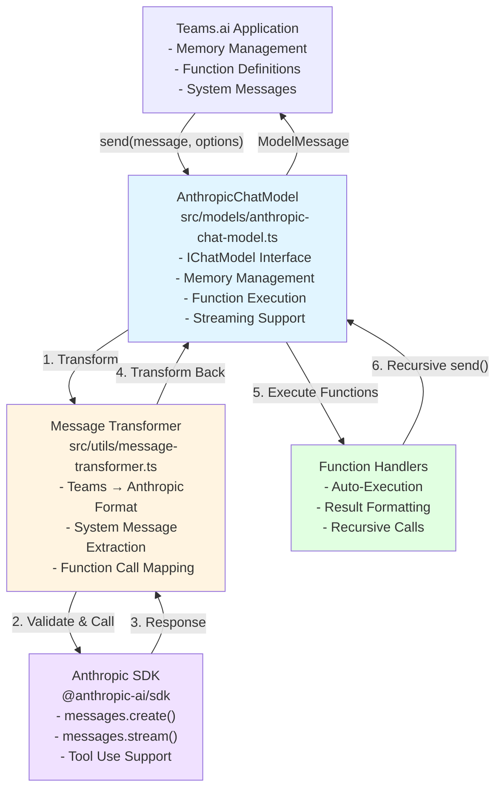

# @youdotcom-oss/teams-anthropic Development Guide

Developer documentation for the Anthropic SDK integration for Microsoft Teams.ai.

---

> **Note for end users**: If you want to use this package (not develop or contribute), see [README.md](./README.md) for setup instructions and usage examples.

**This guide (AGENTS.md) is for developers, contributors, and AI coding agents** who want to:

- Set up a local development environment
- Understand the codebase architecture
- Contribute code or bug fixes
- Run tests and quality checks
- Review pull requests

---

## Tech Stack

- **Runtime**: Bun >= 1.2.21 (not Node.js)
- **Framework**: Microsoft Teams.ai ^2.0.5
- **SDK**: Anthropic SDK ^0.38.0
- **Validation**: TypeScript 5.9.3 with strict type checking
- **Testing**: Bun test (built-in test runner)
- **Code Quality**: Biome 2.3.8 (linter + formatter)
- **Git Hooks**: lint-staged 16.2.7

## Quick Start

### Setup Environment

```bash
# Set API key for integration tests
echo "export ANTHROPIC_API_KEY=your-actual-api-key-here" > .env
source .env
```

### Development Commands

```bash
bun install                    # Install dependencies
bun test                       # Run tests
bun test:watch                 # Run tests in watch mode
bun run check                  # Run all checks (biome + types + package format)
bun run check:write            # Auto-fix all issues
bun run build                  # Build for production
```

## Code Style

This project uses [Biome](https://biomejs.dev/) for automated code formatting and linting. Most style rules are enforced automatically via git hooks.

**For universal code patterns** (Arrow Functions, Numeric Separators, Bun APIs, Import Extensions, etc.), see the [root AGENTS.md](../../AGENTS.md#universal-code-patterns).

## Package-Specific Patterns

### Teams.ai Patterns

**Memory API**: Use `push()` and `values()`, NEVER `addMessage()` or `getMessages()`

```ts
// ✅ Correct
const memory = options?.messages || new LocalMemory();
await memory.push(input);
const messages = await memory.values();

// ❌ Wrong (these methods don't exist)
await memory.addMessage(input);
const messages = await memory.getMessages();
```

**FunctionMessage Structure**: ALWAYS include `function_id` property

```ts
// ✅ Correct
const fnResult: Message = {
  role: 'function',
  function_id: fnCall.id || fnCall.name,
  content: typeof result === 'string' ? result : JSON.stringify(result),
};

// ❌ Wrong (missing function_id)
const fnResult: Message = {
  role: 'function',
  content: result,
};
```

**Function Handler Access**: NEVER call function definition directly, always access handler property

```ts
// ✅ Correct
const fnDef = options.functions[fnCall.name];
if (fnDef && typeof fnDef === 'object' && 'handler' in fnDef) {
  const handler = (fnDef as { handler: (args: unknown) => Promise<unknown> }).handler;
  const result = await handler(fnCall.arguments);
}

// ❌ Wrong (no call signatures on Function type)
const fn = options.functions[fnCall.name];
const result = await fn(fnCall.arguments);
```

### Anthropic Patterns

**Streaming API**: Use `messages.stream()` method, NEVER `messages.create()` with stream parameter

```ts
// ✅ Correct
const stream = this._anthropic.messages.stream({
  ...requestParams,
  stream: true,
});

for await (const event of stream) {
  if (event.type === 'content_block_delta') {
    if (event.delta.type === 'text_delta') {
      const delta = event.delta.text;
      textParts.push(delta);
      if (options.onChunk) {
        await options.onChunk(delta);
      }
    }
  }
}

// ❌ Wrong (type errors)
requestParams.stream = true;
const stream = await this._anthropic.messages.create(requestParams);
```

**System Messages**: Extract system messages separately, Anthropic requires them as separate parameter

```ts
// ✅ Correct
const systemMessage = extractSystemMessage(conversationMessages);
if (systemMessage) {
  requestParams.system = systemMessage;
}

// ❌ Wrong (system messages in conversation array)
const anthropicMessages = transformToAnthropicMessages([
  { role: 'system', content: 'You are helpful' },
  { role: 'user', content: 'Hello' },
]);
```

**Content Block Type Assertions**: Always use explicit type assertions for content blocks

```ts
// ✅ Correct
for (const block of response.content) {
  if (block.type === 'text') {
    const textBlock = block as Anthropic.TextBlock;
    textParts.push(textBlock.text);
  } else if (block.type === 'tool_use') {
    const toolBlock = block as Anthropic.ToolUseBlock;
    toolUses.push({ id: toolBlock.id, name: toolBlock.name, input: toolBlock.input });
  }
}

// ❌ Wrong (missing citations property error)
for (const block of response.content) {
  if (block.type === 'text') {
    textParts.push(block.text);
  }
}
```

## Development Workflow

### Git Hooks

Git hooks are automatically configured after `bun install`:

- **Pre-commit**: Runs Biome check and format-package on staged files
- **Setup**: `bun run prepare` (runs automatically with install)
- Git hooks enforce code quality standards and should never be bypassed

### Code Quality Commands

```bash
# Check everything (CI command)
bun run check                    # Runs biome + types + package format

# Individual checks
bun run check:biome              # Lint and format check
bun run check:types              # TypeScript type check
bun run check:package            # package.json format check

# Auto-fix
bun run check:write              # Fix all auto-fixable issues
bun run lint:fix                 # Fix lint issues only
bun run format                   # Format code only
bun run format:package           # Format package.json only
```

## Architecture

### Package Structure

```
packages/teams-anthropic/
├── src/
│   ├── models/
│   │   ├── anthropic-model.enum.ts      # Type-safe model enum + helpers
│   │   └── anthropic-chat-model.ts      # IChatModel implementation
│   ├── types/
│   │   └── options.ts                   # Configuration types
│   ├── utils/
│   │   └── message-transformer.ts       # Message format conversion
│   ├── tests/
│   │   ├── message-transformer.spec.ts  # Transformer unit tests
│   │   ├── anthropic-model.enum.spec.ts # Enum unit tests
│   │   └── integration.spec.ts          # Integration tests (requires API key)
│   └── main.ts                          # Public API exports
├── examples/
│   ├── basic-chat.ts                    # Basic usage example
│   ├── with-streaming.ts                # Streaming example
│   └── with-functions.ts                # Function calling example
├── docs/
│   └── API.md                           # API reference documentation
├── dist/                                # Compiled output (gitignored)
│   ├── main.js                          # Bundled entry point
│   └── main.d.ts                        # Type definitions
├── package.json                         # Package config (bundled pattern)
├── tsconfig.json                        # TypeScript config (extends root)
├── tsconfig.build.json                  # Build-specific TS config
├── biome.json                           # Biome config (extends root)
├── .gitignore                           # Ignore patterns
├── README.md                            # User documentation
├── AGENTS.md                            # Developer documentation (this file)
└── CHANGELOG.md                         # Version history
```

### System Architecture



### Message Flow

**Standard Message Flow**:
1. Application calls `model.send(message, options)`
2. Message added to memory via `memory.push()`
3. All messages retrieved via `memory.values()`
4. System message extracted from conversation
5. Messages transformed to Anthropic format
6. API call to Anthropic (streaming or non-streaming)
7. Response transformed back to Teams.ai format
8. Response added to memory
9. ModelMessage returned to application

**Function Calling Flow**:
1. Application provides function definitions in options
2. Function definitions converted to Anthropic Tool schema
3. Claude returns tool_use blocks in response
4. tool_use blocks converted to function_calls in ModelMessage
5. **Auto-Execution**: Each function handler called with arguments
6. **Recursive Call**: `send()` called again with FunctionMessage results
7. Claude uses function results to generate final answer
8. Final answer returned to application

### Core Files

#### `src/models/anthropic-model.enum.ts`
**Lines 8-17**: Type-safe enum with exact Anthropic model identifiers

```typescript
export enum AnthropicModel {
  CLAUDE_OPUS_4_5 = 'claude-opus-4-5-20251101',
  CLAUDE_SONNET_4_5 = 'claude-sonnet-4-5-20250929',
  // ... 6 more models
}
```

**Lines 19-26**: Helper functions for model metadata

```typescript
export const getModelDisplayName = (model: AnthropicModel): string => { ... }
export const isValidModel = (value: string): value is AnthropicModel => { ... }
export const getAllModels = (): AnthropicModel[] => { ... }
export const getModelFamily = (model: AnthropicModel): 'opus' | 'sonnet' | 'haiku' => { ... }
```

#### `src/types/options.ts`
**Lines 25-92**: Configuration type for AnthropicChatModel constructor

```typescript
export type AnthropicChatModelOptions = {
  readonly model: AnthropicModel;           // Required: Type-safe enum
  readonly apiKey?: string;                 // Optional: Defaults to env var
  readonly baseUrl?: string;                // Optional: For proxies
  readonly headers?: Record<string, string>;
  readonly timeout?: number;                // Default: 60000ms
  readonly requestOptions?: AnthropicRequestOptions;
  readonly logger?: ILogger;
};
```

**Lines 121-124**: Request options type (omits managed fields)

```typescript
export type AnthropicRequestOptions = Omit<
  Anthropic.MessageCreateParams,
  'model' | 'messages' | 'system' | 'stream' | 'tools'
>;
```

#### `src/utils/message-transformer.ts`
**Purpose**: Critical message format conversion - errors here break all functionality

**Lines 8-91**: `transformToAnthropicMessages()` - Teams.ai → Anthropic

Key transformations:
- User messages: `role: 'user'` → `role: 'user'`
- Model messages: `role: 'model'` → `role: 'assistant'`
- Function messages: `role: 'function'` → `role: 'user'` with tool_result block
- Function calls: `function_calls` array → `tool_use` content blocks

**Lines 93-107**: `extractSystemMessage()` - Extracts system from conversation

Anthropic requires system messages as separate parameter, not in conversation array.

**Lines 109-155**: `transformFromAnthropicMessage()` - Anthropic → Teams.ai

Key transformations:
- Extract text from TextBlock content
- Convert ToolUseBlock to function_calls array
- Return ModelMessage with text and function calls

#### `src/models/anthropic-chat-model.ts`
**Purpose**: Main IChatModel implementation - all business logic

**Lines 48-74**: Constructor - Initialize Anthropic SDK client

```typescript
constructor(options: AnthropicChatModelOptions) {
  this._model = options.model;
  this._requestOptions = options.requestOptions;
  this._log = options.logger || new ConsoleLogger('AnthropicChatModel', { level: 'info' });

  this._anthropic = new Anthropic({
    apiKey: options.apiKey || process.env.ANTHROPIC_API_KEY,
    baseURL: options.baseUrl,
    defaultHeaders: options.headers,
    timeout: options.timeout || 60_000,
  });
}
```

**Lines 103-151**: Function execution handler - Auto-execute functions recursively

Critical pattern:
1. Check if input is model message with function_calls
2. Iterate through each function call
3. Access handler from function definition object
4. Execute handler with arguments
5. Format result as FunctionMessage (MUST include `function_id`)
6. Recursively call `send()` with function result
7. Return final response from recursive call

**Lines 153-162**: System message extraction

```typescript
const systemMessage = extractSystemMessage(
  options?.system ? [options.system, ...conversationMessages] : conversationMessages,
);
```

**Lines 164-191**: API request parameter building

Key steps:
1. Build base parameters (model, messages, max_tokens)
2. Merge default request options
3. Merge per-request options
4. Add system message if present
5. Convert function definitions to Anthropic Tool schema

**Lines 196-251**: Streaming implementation

Critical pattern:
1. Use `messages.stream()` method (NOT `create()` with stream flag)
2. Initialize accumulators for text and tool uses
3. Iterate over stream events with `for await`
4. Handle `content_block_delta` for text deltas
5. Handle `content_block_start` for tool use blocks
6. Call `onChunk` callback for each text delta
7. Build ModelMessage from accumulated data
8. Recursively call `send()` if function calls present

**Lines 254-270**: Non-streaming implementation

Standard API call with response transformation.

**Lines 271-280**: Error handling

Catch all errors and return as ModelMessage (don't throw).

#### `src/main.ts`
**Purpose**: Public API exports - defines what consumers can import

**Lines 26-46**: All exports

```typescript
export { AnthropicChatModel } from './models/anthropic-chat-model.ts';
export {
  AnthropicModel,
  getAllModels,
  getModelDisplayName,
  getModelFamily,
  isValidModel,
} from './models/anthropic-model.enum.ts';
export type { AnthropicChatModelOptions, AnthropicRequestOptions } from './types/options.ts';
export {
  extractSystemMessage,
  transformFromAnthropicMessage,
  transformToAnthropicMessages,
} from './utils/message-transformer.ts';
```

## Testing

### Test Organization

- **Unit Tests**: `src/tests/*.spec.ts` - Test individual utilities and components
- **Integration Tests**: `src/tests/integration.spec.ts` - Test with real Anthropic API
- **Coverage Target**: >80% for core utilities
- **API Key Required**: Integration tests require `ANTHROPIC_API_KEY` environment variable

### Test Files Summary

**Total: 62 tests across 3 files**

- `message-transformer.spec.ts` (16 tests) - Message format transformations
- `anthropic-model.enum.spec.ts` (31 tests) - Model enum utilities
- `integration.spec.ts` (15 tests) - End-to-end with Anthropic API

### Running Tests

```bash
bun test                       # All tests
bun test:watch                 # Run tests in watch mode
bun test src/tests/message-transformer.spec.ts  # Specific file
```

**For universal test patterns** (test() vs it(), retry configuration, error handling, assertion anti-patterns), see the [root AGENTS.md](../../AGENTS.md#universal-code-patterns).

### Package-Specific Testing Patterns

**API Key-Dependent Tests** - Skip tests when API key missing:

```ts
const ANTHROPIC_API_KEY = process.env.ANTHROPIC_API_KEY;
const describeWithApiKey = ANTHROPIC_API_KEY ? describe : describe.skip;

describeWithApiKey('Integration Tests', () => {
  // Tests only run if ANTHROPIC_API_KEY is set
});
```

**LocalMemory for Context** - Use Teams.ai memory for conversation tests:

```ts
const { LocalMemory } = await import('@microsoft/teams.ai');
const memory = new LocalMemory();

// Memory persists context between calls
await model.send({ role: 'user', content: 'My name is Alice.' }, { messages: memory });
await model.send({ role: 'user', content: 'What is my name?' }, { messages: memory });
```

**Type Assertions Over Non-Null** - Use type assertions for safer code:

```ts
// ✅ Preferred
expect(response.function_calls[0]?.name).toBe('get_weather');

// ❌ Avoid
expect(response.function_calls![0]!.name).toBe('get_weather');
```

## Building and Publishing

### Build Configuration

**Pattern**: Bundled package (single compiled file with external dependencies)

**Build Scripts** (package.json):
```json
{
  "build": "bun run build:bundle && bun run build:types",
  "build:bundle": "bun build src/main.ts --outdir dist --target node --external @anthropic-ai/sdk --external @microsoft/teams.ai --external @microsoft/teams.common",
  "build:types": "tsc --project tsconfig.build.json --declaration --emitDeclarationOnly --noEmit false",
  "prepublishOnly": "bun run build"
}
```

**Why bundle?**
- Single file distribution (easier consumption)
- Reduced installation time (fewer dependencies)
- External dependencies avoid duplication in user's node_modules

### Building Locally

```bash
# Build for production
bun run build

# Outputs:
# - dist/main.js (compiled entry point)
# - dist/main.d.ts (type definitions)
```

### Publishing

This package is published to npm via the `.github/workflows/publish-teams-anthropic.yml` workflow in the monorepo root.

**Workflow Actions**:
1. Updates version in `packages/teams-anthropic/package.json`
2. Scans all workspace packages for dependencies on `@youdotcom-oss/teams-anthropic`
3. Updates dependent packages with exact version (e.g., "1.0.0")
4. Commits all version updates together
5. Creates GitHub release with tag `v{version}`
6. Publishes to npm
7. No deployment step (unlike MCP package)

**Version Format**: Exact versions only (no `^` or `~` prefixes)

```json
{
  "dependencies": {
    "@youdotcom-oss/teams-anthropic": "1.0.0"
  }
}
```

**IMPORTANT**: If you add dependencies on other workspace packages, use exact version numbers. The publish workflow will automatically keep them in sync.

## Troubleshooting

### Common Issues

#### TypeScript Type Errors

**Symptom**: `Property 'addMessage' does not exist on type 'IMemory'`

**Solution**: Use correct LocalMemory API methods:

```ts
// ✅ Correct
await memory.push(message);
const messages = await memory.values();

// ❌ Wrong
await memory.addMessage(message);
const messages = await memory.getMessages();
```

---

**Symptom**: `Property 'function_id' is missing`

**Solution**: ALWAYS include `function_id` in FunctionMessage:

```ts
// ✅ Correct
const fnResult: Message = {
  role: 'function',
  function_id: fnCall.id || fnCall.name,
  content: result,
};

// ❌ Wrong
const fnResult: Message = {
  role: 'function',
  content: result,
};
```

---

**Symptom**: `Type 'Function' has no call signatures`

**Solution**: Access handler from function definition object:

```ts
// ✅ Correct
const fnDef = options.functions[fnCall.name];
if (fnDef && typeof fnDef === 'object' && 'handler' in fnDef) {
  const handler = (fnDef as { handler: (args: unknown) => Promise<unknown> }).handler;
  const result = await handler(fnCall.arguments);
}

// ❌ Wrong
const fn = options.functions[fnCall.name];
const result = await fn(fnCall.arguments);
```

---

**Symptom**: `Type 'true' is not assignable to type 'false'` (streaming)

**Solution**: Use `messages.stream()` method instead of `create()` with stream parameter:

```ts
// ✅ Correct
const stream = this._anthropic.messages.stream({
  ...requestParams,
  stream: true,
});

// ❌ Wrong
requestParams.stream = true;
const stream = await this._anthropic.messages.create(requestParams);
```

#### Import/Build Errors

**Symptom**: Biome adding `.js.ts` double extensions

**Solution**: ALWAYS use `.ts` for local file imports:

```ts
// ✅ Correct
import { AnthropicModel } from './models/anthropic-model.enum.ts';

// ❌ Wrong
import { AnthropicModel } from './models/anthropic-model.enum.js';
import { AnthropicModel } from './models/anthropic-model.enum';
```

---

**Symptom**: Build fails with missing dependencies

**Solution**: Check peer dependencies are installed:

```bash
# Install peer dependencies
bun add @microsoft/teams.ai @microsoft/teams.common

# Verify installation
bun run check:types
```

#### Test Failures

**Symptom**: Integration tests fail with authentication error

**Solution**: Set `ANTHROPIC_API_KEY` environment variable:

```bash
export ANTHROPIC_API_KEY=your-api-key-here
bun test
```

---

**Symptom**: Test expects array but gets string

**Solution**: Update test expectations to match implementation:

```ts
// Current implementation converts multi-part to string
it('should transform multi-part content to string', () => {
  expect(typeof result[0]?.content).toBe('string');
});
```

## Contributing

See [root AGENTS.md](../../AGENTS.md#contributing) for contribution guidelines.

**Package-specific scope**: Use `teams-anthropic` scope in commit messages:

```bash
feat(teams-anthropic): add new memory adapter
fix(teams-anthropic): resolve streaming issue
```

## Publishing

See [root AGENTS.md](../../AGENTS.md#publishing) for the package publishing process.

**Package-specific**: Workflow name is "Publish teams-anthropic Release"

## Support

See [root AGENTS.md](../../AGENTS.md#support) for general support resources.

**Package-Specific Resources**:
- **Troubleshooting**: [README.md](./README.md#troubleshooting)
- **Memory Adapters**: [docs/MEMORY_ADAPTERS.md](./docs/MEMORY_ADAPTERS.md)
