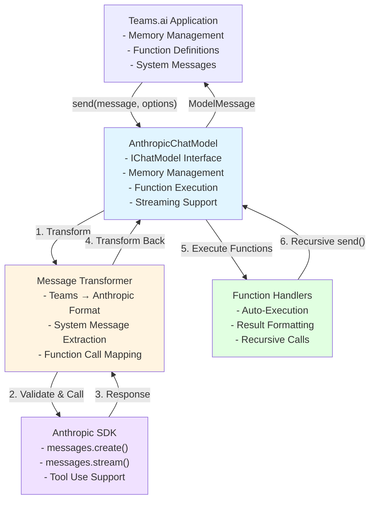

# @youdotcom-oss/teams-anthropic Development Guide

Developer documentation for the Anthropic SDK integration for Microsoft Teams.ai.

---

> **Note for end users**: If you want to use this package (not develop or contribute), see [README.md](./README.md) for setup instructions and usage examples.

**This guide (AGENTS.md) is for developers, contributors, and AI coding agents** who want to:

- Set up a local development environment
- Understand the codebase architecture
- Contribute code or bug fixes
- Run tests and quality checks
- Review pull requests

---

## Tech Stack

- **Runtime**: Bun >= 1.2.21 (not Node.js)
- **Framework**: Microsoft Teams.ai ^2.0.5
- **SDK**: Anthropic SDK ^0.38.0
- **Validation**: TypeScript 5.9.3 with strict type checking
- **Testing**: Bun test (built-in test runner)
- **Code Quality**: Biome 2.3.8 (linter + formatter)

## Quick Start

```bash
cd packages/teams-anthropic

# Set API key
echo "export ANTHROPIC_API_KEY=your-actual-api-key-here" > .env
source .env

# Install dependencies (from monorepo root)
cd ../..
bun install

# From package directory
cd packages/teams-anthropic
bun test                       # Run tests
bun run check                  # Run all checks
```

## Code Style

> **For universal patterns**: See [`.claude/rules/code-patterns.md`](../../.claude/rules/code-patterns.md)

> **For Teams.ai and Anthropic patterns**: See [`.claude/skills/teams-ai-patterns`](../../.claude/skills/teams-ai-patterns/SKILL.md)

## Teams.ai-Specific Patterns

The teams-ai-patterns skill covers all framework-specific patterns. Key patterns include:

### Memory API

Teams.ai Memory uses `push()` and `values()`, NEVER `addMessage()` or `getMessages()`:

```typescript
// ✅ Correct
await memory.push(message);
const messages = await memory.values();

// ❌ Wrong
await memory.addMessage(message);
const messages = await memory.getMessages();
```

### FunctionMessage Structure

ALWAYS include `function_id` property in FunctionMessage:

```typescript
// ✅ Correct
const fnResult: Message = {
  role: 'function',
  function_id: fnCall.id || fnCall.name,
  content: result,
};

// ❌ Wrong - Missing function_id
const fnResult: Message = {
  role: 'function',
  content: result,
};
```

### Function Handler Access

Access handler property from function definition object, NEVER call directly:

```typescript
// ✅ Correct
const fnDef = options.functions[fnCall.name];
if (fnDef && typeof fnDef === 'object' && 'handler' in fnDef) {
  const handler = (fnDef as { handler: (args: unknown) => Promise<unknown> }).handler;
  const result = await handler(fnCall.arguments);
}

// ❌ Wrong
const fn = options.functions[fnCall.name];
const result = await fn(fnCall.arguments);
```

### Anthropic Streaming

Use `messages.stream()` method, NOT `create()` with stream flag:

```typescript
// ✅ Correct
const stream = this._anthropic.messages.stream({
  ...requestParams,
  stream: true,
});

// ❌ Wrong
requestParams.stream = true;
const stream = await this._anthropic.messages.create(requestParams);
```

### System Message Extraction

Anthropic requires system messages as separate parameter, not in conversation array:

```typescript
const systemMessage = extractSystemMessage(
  options?.system ? [options.system, ...conversationMessages] : conversationMessages,
);
```

## Architecture

### Package Structure

```
packages/teams-anthropic/
├── src/
│   ├── models/
│   │   ├── anthropic-model.enum.ts      # Type-safe model enum + helpers
│   │   └── anthropic-chat-model.ts      # IChatModel implementation
│   ├── types/
│   │   └── options.ts                   # Configuration types
│   ├── utils/
│   │   └── message-transformer.ts       # Message format conversion
│   ├── tests/
│   │   ├── message-transformer.spec.ts  # Transformer unit tests
│   │   ├── anthropic-model.enum.spec.ts # Enum unit tests
│   │   └── integration.spec.ts          # Integration tests
│   └── main.ts                          # Public API exports
├── examples/                            # Usage examples
├── dist/                                # Compiled output
└── package.json                         # Bundled package config
```

### System Architecture


```mermaid
graph TD
    Client["Teams.ai Application
    - Memory Management
    - Function Definitions
    - System Messages"]

    Client -->|"send(message, options)"| ChatModel["AnthropicChatModel
    - IChatModel Interface
    - Memory Management
    - Function Execution
    - Streaming Support"]

    ChatModel -->|"1. Transform"| Transformer["Message Transformer
    - Teams → Anthropic Format
    - System Message Extraction
    - Function Call Mapping"]

    Transformer -->|"2. Validate & Call"| SDK["Anthropic SDK
    - messages.create()
    - messages.stream()
    - Tool Use Support"]

    SDK -->|"3. Response"| Transformer
    Transformer -->|"4. Transform Back"| ChatModel

    ChatModel -->|"5. Execute Functions"| Functions["Function Handlers
    - Auto-Execution
    - Result Formatting
    - Recursive Calls"]

    Functions -->|"6. Recursive send()"| ChatModel

    ChatModel -->|"ModelMessage"| Client

    style ChatModel fill:#e1f5ff
    style Transformer fill:#fff4e1
    style SDK fill:#f0e1ff
    style Functions fill:#e1ffe1
```

### Message Flow

**Standard Message Flow**:
1. Application calls `model.send(message, options)`
2. Message added to memory via `memory.push()`
3. All messages retrieved via `memory.values()`
4. System message extracted from conversation
5. Messages transformed to Anthropic format
6. API call to Anthropic (streaming or non-streaming)
7. Response transformed back to Teams.ai format
8. Response added to memory
9. ModelMessage returned to application

**Function Calling Flow**:
1. Application provides function definitions in options
2. Function definitions converted to Anthropic Tool schema
3. Claude returns tool_use blocks in response
4. tool_use blocks converted to function_calls in ModelMessage
5. **Auto-Execution**: Each function handler called with arguments
6. **Recursive Call**: `send()` called again with FunctionMessage results
7. Claude uses function results to generate final answer
8. Final answer returned to application

### Core Files

- **`src/models/anthropic-model.enum.ts`** - Type-safe model enum with helper functions
- **`src/types/options.ts`** - Configuration types for AnthropicChatModel
- **`src/utils/message-transformer.ts`** - Critical message format conversion (Teams.ai ↔ Anthropic)
- **`src/models/anthropic-chat-model.ts`** - Main IChatModel implementation with function execution
- **`src/main.ts`** - Public API exports

## Testing

> **For universal test patterns**: See [`.claude/rules/code-patterns.md`](../../.claude/rules/code-patterns.md)

### Test Organization

- **Unit Tests**: `src/tests/*.spec.ts` - Test individual utilities and components
- **Integration Tests**: `src/tests/integration.spec.ts` - Test with real Anthropic API
- **Total**: 62 tests across 3 files

### Running Tests

```bash
# All tests
bun test

# Watch mode
bun test:watch

# Specific file
bun test src/tests/integration.spec.ts
```

**Prerequisites**:
- `ANTHROPIC_API_KEY` environment variable for integration tests
- Stable network connection

### Teams.ai-Specific Testing Patterns

**API Key-Dependent Tests** - Skip tests when API key missing:

```typescript
const ANTHROPIC_API_KEY = process.env.ANTHROPIC_API_KEY;
const describeWithApiKey = ANTHROPIC_API_KEY ? describe : describe.skip;

describeWithApiKey('Integration Tests', () => {
  // Tests only run if ANTHROPIC_API_KEY is set
});
```

**LocalMemory for Context** - Use Teams.ai memory for conversation tests:

```typescript
const { LocalMemory } = await import('@microsoft/teams.ai');
const memory = new LocalMemory();

// Memory persists context between calls
await model.send({ role: 'user', content: 'My name is Alice.' }, { messages: memory });
await model.send({ role: 'user', content: 'What is my name?' }, { messages: memory });
```

## Building and Publishing

### Build Configuration

**Pattern**: Bundled package (single compiled file with external dependencies)

```bash
# Build for production
bun run build

# Outputs:
# - dist/main.js (compiled entry point)
# - dist/main.d.ts (type definitions)
```

**Why bundle?**
- Single file distribution (easier consumption)
- Reduced installation time (fewer dependencies)
- External dependencies avoid duplication in user's node_modules

### Publishing

This package is published to npm via `.github/workflows/publish-teams-anthropic.yml`.

See [root AGENTS.md](../../AGENTS.md#publishing) for complete workflow documentation.

**IMPORTANT**: If you add dependencies on other workspace packages, use exact version numbers. The publish workflow will automatically keep them in sync.

## Troubleshooting

### Teams.ai Memory API Errors

**Symptom**: `Property 'addMessage' does not exist on type 'IMemory'`

**Solution**: Use correct LocalMemory API methods:

```typescript
// ✅ Correct
await memory.push(message);
const messages = await memory.values();

// ❌ Wrong
await memory.addMessage(message);
const messages = await memory.getMessages();
```

### FunctionMessage Missing Property

**Symptom**: `Property 'function_id' is missing`

**Solution**: ALWAYS include `function_id` in FunctionMessage:

```typescript
// ✅ Correct
const fnResult: Message = {
  role: 'function',
  function_id: fnCall.id || fnCall.name,
  content: result,
};

// ❌ Wrong
const fnResult: Message = {
  role: 'function',
  content: result,
};
```

### Function Handler Type Error

**Symptom**: `Type 'Function' has no call signatures`

**Solution**: Access handler from function definition object:

```typescript
// ✅ Correct
const fnDef = options.functions[fnCall.name];
if (fnDef && typeof fnDef === 'object' && 'handler' in fnDef) {
  const handler = (fnDef as { handler: (args: unknown) => Promise<unknown> }).handler;
  const result = await handler(fnCall.arguments);
}

// ❌ Wrong
const fn = options.functions[fnCall.name];
const result = await fn(fnCall.arguments);
```

### Anthropic Streaming Type Error

**Symptom**: `Type 'true' is not assignable to type 'false'`

**Solution**: Use `messages.stream()` method instead of `create()` with stream parameter:

```typescript
// ✅ Correct
const stream = this._anthropic.messages.stream({
  ...requestParams,
  stream: true,
});

// ❌ Wrong
requestParams.stream = true;
const stream = await this._anthropic.messages.create(requestParams);
```

### Integration Tests Authentication Error

**Symptom**: Integration tests fail with authentication error

**Solution**: Set `ANTHROPIC_API_KEY` environment variable:

```bash
echo "export ANTHROPIC_API_KEY=your-api-key-here" > .env
source .env
bun test
```

## Contributing

See [root AGENTS.md](../../AGENTS.md#contributing) and [CONTRIBUTING.md](../../CONTRIBUTING.md) for guidelines.

**Package-specific scope**: Use `teams-anthropic` scope in commit messages:

```bash
feat(teams-anthropic): add new memory adapter
fix(teams-anthropic): resolve streaming issue
```

## Related Skills

- [`.claude/skills/teams-ai-patterns`](../../.claude/skills/teams-ai-patterns/SKILL.md) - Teams.ai framework patterns
- [`.claude/rules/code-patterns.md`](../../.claude/rules/code-patterns.md) - Universal code patterns
- [`.claude/skills/documentation`](../../.claude/skills/documentation/SKILL.md) - Documentation standards

## Support

- **Package Issues**: Create issue in [GitHub Issues](https://github.com/youdotcom-oss/dx-toolkit/issues)
- **Troubleshooting**: [README.md](./README.md#troubleshooting)
- **Memory Adapters**: [docs/MEMORY_ADAPTERS.md](./docs/MEMORY_ADAPTERS.md)
- **Email**: support@you.com
